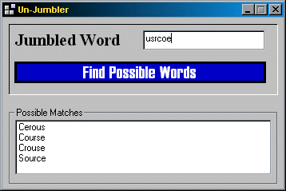



## Jumble Word Solver \[Heavily Documented\]

### Description

This takes a jumbled word and compares it to a list of words (apprx 110,000 words) that are commonly used in crossword puzzles and such. I got this paticualr idea from Robert Rayment's code on finding anagrams for a word. You can also replace the provided word list with a bigger one. please give all feedback positive and negative. Thanks, and vote
 
### More Info
 

             |
---                |---
**Submitted On**   |2002-03-18 18:42:04
**By**             |[Joe Shmoe](https://github.com/Planet-Source-Code/PSCIndex/blob/master/ByAuthor/joe-shmoe.md)
**Level**          |Intermediate
**User Rating**    |5.0 (25 globes from 5 users)
**Compatibility**  |VB 6\.0
**Category**       |[String Manipulation](https://github.com/Planet-Source-Code/PSCIndex/blob/master/ByCategory/string-manipulation__1-5.md)
**World**          |[Visual Basic](https://github.com/Planet-Source-Code/PSCIndex/blob/master/ByWorld/visual-basic.md)
**Archive File**   |[Jumble\_Wor632003182002\.zip](https://github.com/Planet-Source-Code/joe-shmoe-jumble-word-solver-heavily-documented__1-32800/archive/master.zip)

